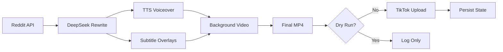

# Reddit Story TikTok Pipeline

Automated Dockerized pipeline that creates Reddit-story TikTok videos with AI-rewritten narration, burned-in subtitles, and looping gameplay backgrounds — then posts them to TikTok up to three times per day.

## Architecture



## Prerequisites

- **Docker** and **Docker Compose**
- **Reddit API app** (script type) — [create one here](https://www.reddit.com/prefs/apps)
- **DeepSeek API key** — [get one here](https://platform.deepseek.com/api_keys)
- **TikTok account** for posting
- **Gameplay clips** — MP4 files you own or have license to use

## Project Structure

```
├── Dockerfile
├── docker-compose.yml
├── docker-compose.ofelia.yml    # Optional Ofelia scheduler
├── run_pipeline.py              # Main entry point
├── rewrite_story.py             # DeepSeek API integration
├── subtitle_generator.py        # Burned-in subtitle rendering
├── upload_tiktok.py             # TikTok upload wrapper
├── requirements.txt
├── .env.example
├── .gitignore
├── scripts/
│   └── install_cron.sh
├── video_bot/                   # Upstream RedditVideoMakerBot
├── assets/
│   ├── backgrounds/             # Your gameplay MP4 files
│   │   └── README.md
│   └── cookies/                 # Persistent TikTok sessions
├── results/                     # Generated MP4 files
├── logs/                        # Pipeline logs
└── state/
    ├── posted_ids.json          # Deduplication tracking
    └── upload_history.json      # Upload history
```

## Quick Start

### 1. Clone and configure

```bash
git clone <this-repo> reddit-video-pipeline
cd reddit-video-pipeline

cp .env.example .env
# Edit .env with your DeepSeek API key and TikTok username
# Leave DRY_RUN=true for now
```

### 2. Build the Docker image

```bash
docker compose build
```

### 3. First Reddit configuration (interactive)

```bash
# Create empty config.toml file on host first (required for volume mount)
touch config.toml

# Run interactive setup with the config file mounted
docker compose run --rm \
  -v "$(pwd)/config.toml:/app/video_bot/config.toml" \
  reddit-bot python main.py
```

Follow the prompts to enter:
- Reddit app client ID and secret
- Reddit username and password
- Subreddit(s) to pull from (e.g., `AmItheAsshole`, `EntitledParents`)
- TTS voice choice (GoogleTranslate is free and works well)
- Other settings (accept defaults)

`config.toml` is now persisted on your host. Uncomment the `config.toml` mount line in `docker-compose.yml` for future runs:

```yaml
# In docker-compose.yml, uncomment:
  - ./config.toml:/app/video_bot/config.toml
```

### 4. Add gameplay backgrounds

Place your `.mp4` gameplay files in `assets/backgrounds/`:

```bash
cp your-gameplay.mp4 assets/backgrounds/
```

**Important legal notice:** Only use gameplay you own, recorded yourself, licensed for reuse, or explicitly marked royalty-free/commercial-use permitted. Do not use copyrighted content without permission.

### 5. First TikTok login (interactive, one-time)

```bash
docker compose run --rm reddit-bot python -c "
from tiktokautouploader.function import _load_or_create_cookies
_load_or_create_cookies('YOUR_TIKTOK_USERNAME', None)
"
```

A browser window will open for you to log into TikTok. After successful login, session cookies are saved to `assets/cookies/` and will persist across container restarts.

If the browser doesn't open (headless server), run this command locally with a display, then copy the `assets/cookies/` folder to your server.

### 6. Test dry run

```bash
docker compose run --rm reddit-bot
```

This will:
1. Fetch a Reddit story from your configured subreddit
2. Rewrite it with DeepSeek
3. Generate voiceover and subtitle overlays
4. Compose a vertical 9:16 MP4 with looping gameplay background
5. Save the MP4 to `results/`
6. Log everything — **no TikTok upload happens**

Check `results/` for the output video. Review the quality of narration, subtitles, and composition.

### 7. Enable live upload

Edit `.env`:

```env
DRY_RUN=false
POSTS_PER_DAY=1   # Start with 1 per day
```

Run once:

```bash
docker compose run --rm reddit-bot
```

Check your TikTok account — the video should appear within a minute.

### 8. Set up scheduling

#### Preferred: host cron

```bash
bash scripts/install_cron.sh
```

This schedules runs at 09:00, 14:00, and 19:00 local server time. Logs go to `logs/cron.log`.

Manual cron entries:

```
0 9 * * * cd /path/to/project && docker compose run --rm reddit-bot >> logs/cron.log 2>&1
0 14 * * * cd /path/to/project && docker compose run --rm reddit-bot >> logs/cron.log 2>&1
0 19 * * * cd /path/to/project && docker compose run --rm reddit-bot >> logs/cron.log 2>&1
```

#### Alternative: Ofelia scheduler

```bash
docker compose -f docker-compose.yml -f docker-compose.ofelia.yml up -d
```

Update the command paths in `docker-compose.ofelia.yml` to match your project directory.

## Safe Rollout Plan

1. **Dry-run** — Generate videos only. Review scripts, audio, captions, and output quality manually.
2. **Manual posting** — Upload generated videos manually for several days to verify account/content performance.
3. **Low automation** — Set `DRY_RUN=false` and `POSTS_PER_DAY=1`. Run once daily.
4. **Scale** — Increase to three uploads/day only once login sessions, output quality, and account status are stable.

`POSTS_PER_DAY` acts as a hard guard — the pipeline refuses to post more than the configured limit even if the scheduler triggers extra runs.

## Environment Variables

| Variable | Default | Description |
|----------|---------|-------------|
| `DEEPSEEK_API_KEY` | (required) | DeepSeek API key for story rewriting |
| `TIKTOK_ACCOUNTNAME` | (required) | TikTok username for posting |
| `DRY_RUN` | `true` | Generate video only, skip TikTok upload |
| `POSTS_PER_DAY` | `1` | Maximum uploads per calendar day |
| `TIMEZONE` | `UTC` | Server timezone for scheduling reference |

## How It Works

### Content pipeline

1. **Reddit fetch** — Pulls a hot post from your configured subreddit (storymode: uses post selftext, not comments).
2. **DeepSeek rewrite** — Rewrites the story for TikTok narration: adds a strong hook, shortens sentences, removes filler/usernames/links. Falls back to original text if the API is unavailable.
3. **TTS voiceover** — Generates MP3 narration using your chosen TTS provider (Google Translate TTS is free).
4. **Subtitle overlays** — Generates high-contrast text PNGs with white text and black shadow outlines, overlaid on the gameplay background at the correct timestamps.
5. **Background loop** — Selects a background gameplay video, crops to 9:16 vertical, loops or cuts to match narration duration.
6. **Final render** — FFmpeg composes everything into a vertical MP4.
7. **TikTok upload** — Uses `tiktokautouploader` with Phantomwright stealth browser to post the video.

### Deduplication

- `state/posted_ids.json` tracks every story ID that has been posted.
- The pipeline skips any Reddit post whose ID appears in this file.
- Never regenerates or reposts the same story.

### State persistence

- `posted_ids.json` — Reddit post IDs that have been processed
- `upload_history.json` — Full upload records with timestamps, captions, backgrounds used
- `assets/cookies/` — TikTok session cookies (survive container deletion)
- `config.toml` — Reddit app credentials and pipeline settings

All state files use atomic writes (write to `.tmp`, then `os.replace`) to prevent corruption.

## Troubleshooting

### Docker/Playwright browser errors

**Symptom:** `Executable doesn't exist` or browser launch failure.

**Fix:** Rebuild the image — Playwright/Phantomwright Chromium dependencies may have changed:

```bash
docker compose build --no-cache
```

Verify Chromium in container:

```bash
docker compose run --rm reddit-bot python -c "from playwright.sync_api import sync_playwright; p = sync_playwright().start(); p.chromium.launch(); print('OK')"
```

### Missing config.toml

**Symptom:** `Couldn't find config.toml`

**Fix:** Run the interactive setup:

```bash
docker compose run --rm reddit-bot python main.py
```

### DeepSeek failure

**Symptom:** `DeepSeek attempt 1 failed` in logs.

**Fix:** The pipeline falls back to using the original Reddit text. Check:
- `DEEPSEEK_API_KEY` is set correctly in `.env`
- Your DeepSeek account has credits
- `https://api.deepseek.com` is reachable from your server

### No eligible Reddit post

**Symptom:** `No Reddit thread returned` or empty content.

**Fix:**
- Ensure the subreddit exists and has posts with substantial selftext
- Try a different subreddit (edit `config.toml` or rerun interactive setup)
- Check `storymode_max_length` in `config.toml` — increase if stories are too long
- Stories marked `[removed]`, `[deleted]`, or NSFW are automatically skipped

### Missing output MP4

**Symptom:** `No output video found in results/!`

**Fix:**
- Check logs for FFmpeg errors (encoding failures)
- Ensure `assets/backgrounds/` has at least one MP4 file
- Verify `ffmpeg` is installed in the container: `docker compose run --rm reddit-bot ffmpeg -version`
- Check if `h264_nvenc` encoder is available (GPU encoding). If not, edit `video_creation/final_video.py` and change `"c:v": "libx264"` to `"c:v": "h264_nvenc"` (this is already the default in this project)

### TikTok session expiry / login challenge

**Symptom:** `TikTokUploadError` or `COOKIES EXPIRED` in logs.

**Fix:** Re-run the TikTok login step:

```bash
docker compose run --rm reddit-bot python -c "
from tiktokautouploader.function import _load_or_create_cookies
_load_or_create_cookies('YOUR_TIKTOK_USERNAME', None)
"
```

### Captcha during upload

**Symptom:** Upload fails with captcha-related error.

**Explanation:** The `inference-sdk` captcha auto-solver is not included (it conflicts with other dependencies). If TikTok presents a captcha challenge, manual intervention is required.

**Fix:** Re-authenticate via the TikTok login step above. Captchas are more common on new accounts or accounts accessed from different IPs.

## Safety Notes

- This tool automates TikTok posting using browser automation. This is not an official TikTok API workflow and may violate TikTok's Terms of Service. Use at your own risk.
- TikTok may rate-limit, shadowban, or suspend accounts that use automation. Start slowly, use a backup account, and monitor account health.
- Copyright infringement on gameplay footage, music, or Reddit content can result in DMCA takedowns or account termination. Only use content you have rights to.
- This is not a guaranteed income source. Content performance depends on algorithm factors beyond automation control.
- Store API keys and credentials securely. Never commit `.env` or `config.toml` to version control.
- Login sessions expire periodically. Monitor logs for authentication failures and re-authenticate promptly.

## Commands Reference

| Action | Command |
|--------|---------|
| Build | `docker compose build` |
| Interactive Reddit setup | `touch config.toml && docker compose run --rm -v "$(pwd)/config.toml:/app/video_bot/config.toml" reddit-bot python main.py` |
| TikTok login | `docker compose run --rm reddit-bot python -c "from tiktokautouploader.function import _load_or_create_cookies; _load_or_create_cookies('USERNAME', None)"` |
| Dry run | `docker compose run --rm reddit-bot` |
| Live upload | `docker compose run --rm reddit-bot` (with `DRY_RUN=false` in `.env`) |
| Install cron | `bash scripts/install_cron.sh` |
| Start Ofelia | `docker compose -f docker-compose.yml -f docker-compose.ofelia.yml up -d` |
| View logs | `tail -f logs/cron.log` or `docker compose logs` |

## License

This project builds on [RedditVideoMakerBot](https://github.com/elebumm/RedditVideoMakerBot) (MIT).
The pipeline orchestration, DeepSeek integration, and subtitle generation are original code.
